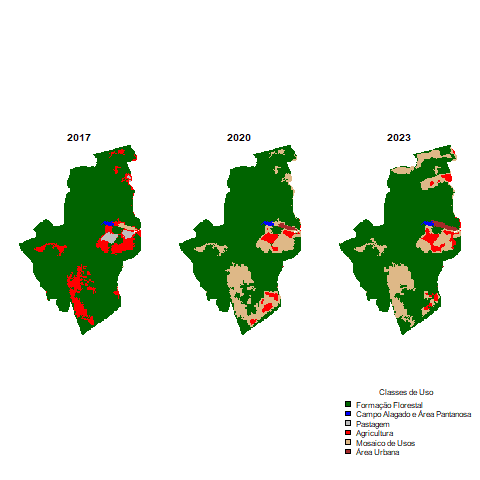
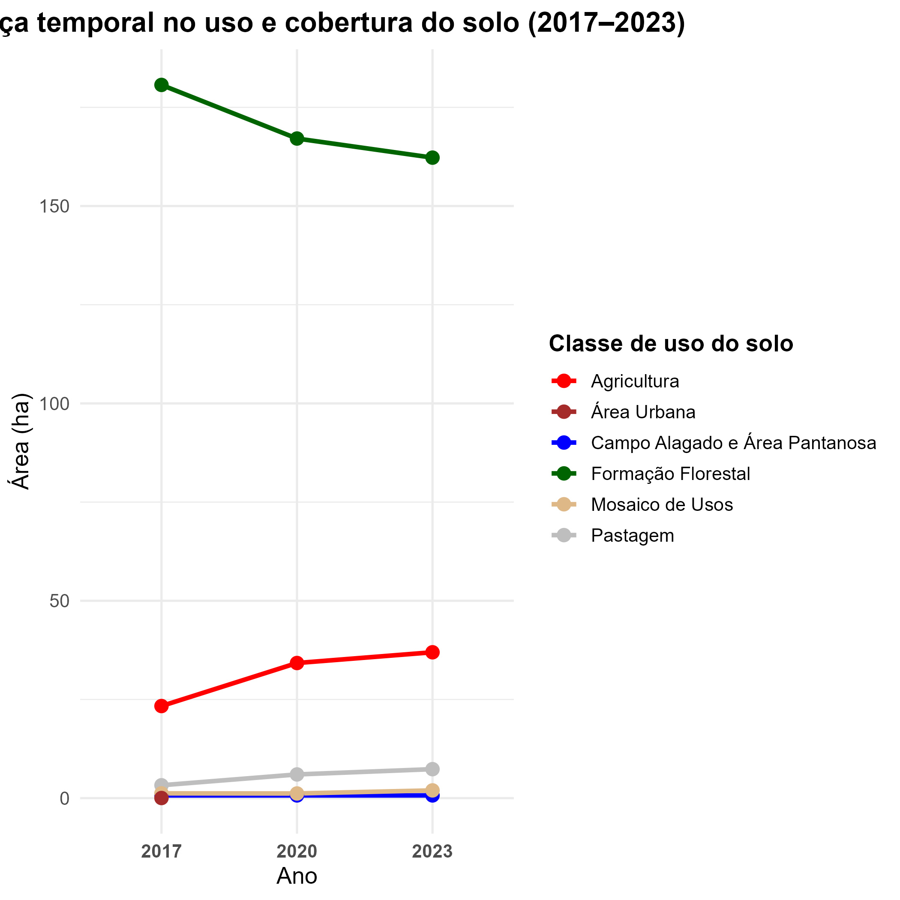

```{r setup, include=FALSE}
knitr::opts_chunk$set(echo = TRUE, warning = FALSE, message = FALSE)

# Carregando pacotes necessarios para a pratica #

library(knitr)
library(kableExtra)
library(terra)
library(ggplot2)
library(dplyr)
library(tidyr)
library(sf)
```

# Objetivo

Na área de estudo foi observada a ocorrência de mudanças no uso e cobertura da terra entre os anos de 2017 e 2023.
No entanto, ainda não se sabe qual foi a extensão dessas transformações ao longo do período.
Assim, o objetivo deste projeto é quantificar e comparar a área que sofreu alteração no uso da terra entre os anos de 2017, 2020 e 2023, a partir de imagens do MapBiomas com resolução espacial de 10 metros.
Nesse sentido, a pergunta norteadora para realização do projeto foi: Qual foi a extensão e a localização das mudanças no uso da terra na área de estudo entre 2017 e 2023?


# Dados

Para as análises, utilizei um arquivo vetorial (shapefile) contendo o limite da área de estudo.

-   **Fontes e links**

    As imagens de cobertura e uso da terra obtidas na plataforma MapBiomas, que correspondem aos anos de 2017, 2020 e 2023, com resolução espacial de 10 metros.
    As informações de uso e cobertura da terra foram obtidas a partir da Coleção 10 do MapBiomas, disponível em: <https://plataforma.brasil.mapbiomas.org/> Para extrair informações da cobertura apenas da região de interesse, utilizei a opção "Criar Análise" e extrai apenas informações de cobertura do município de Una (BA) para cada ano de interesse.

-   **Estrutura e dicionário**

    Para a classificação de uso e cobertura da terra foi utilizado as legendas disponíveis pelo próprio MapBiomas, indicando o que cada valor de pixel representa (classe).
    As legendas estão disponíveis no link:<https://brasil.mapbiomas.org/wp-content/uploads/sites/4/2025/08/Legenda-Colecao-10-Legend-Code.pdf>

-   **Licença e termos de uso**

    Os dados são de acesso público e estão disponíveis sob a Licença Creative Commons Atribuição 4.0 Internacional (CC BY 4.0), permitindo o uso, compartilhamento e adaptação, desde que citada a fonte.


# Métodos

As etapas de processamento e análise dos dados foram realizadas utilizando diferentes pacotes voltados à manipulação de dados espaciais, visualização cartográfica e análise estatística.
Todo o fluxo de trabalho foi documentado em scripts armazenados na pasta scripts/, de modo a garantir a rastreabilidade e a reprodutibilidade das análises.

-   **Estrutura de pastas**

    Inicialmente foi criada uma estrutura de pastas já sugeridas no roteiro previamente disponível.
    Para realização desta etapa, foi seguido o script 'scripts/01_importancao.R/estrutura_pastas.R'

-   **Importação dos dados**

    As imagens de uso e cobertura da terra correspondentes aos anos de 2017, 2020 e 2023 foram obtidas na plataforma MapBiomas (Coleção 10), com resolução espacial de 10 metros, e importadas no R no formato raster (.tif).
    O limite da área de estudo, delimitado previamente, foi importado no formato vetorial (.shp).
    As importações e manipulações espaciais foram conduzidas com os pacotes terra e sf, utilizados para o tratamento de dados geoespaciais.

-   **Recorte das Imagens**

    Em seguida, cada imagem raster do MapBiomas foi recortada e mascarada utilizando o shapefile da área de estudo.
    O recorte (crop) limitou as imagens à extensão geográfica da área analisada, enquanto a máscara (mask) removeu pixels externos à fronteira delimitada.
    Essa etapa garantiu que as análises fossem restritas à região de interesse e otimizou o desempenho computacional.
    Para realização desta etapa, foi seguido o script 'scripts/02_analise.R/classe_uso_cobertura.R'

-   **Cálculo da área de mudança**

    Após o pré-processamento, foi realizada o cálculo das áreas correspondentes a cada classe de uso e cobertura da terra, em ha.
    O cálculo considerou a frequência de pixels de cada categoria e o tamanho do pixel (10 × 10 metros, equivalente a 0,01 hectare).
    Essa etapa foi conduzida com os pacotes terra, dplyr e tibble, responsáveis pela manipulação de dados raster e tabulares.
    O resultado deste cálculo gerou uma tabela que posteriormente será utilizado para construção do gráfico de linha, tornando possível identificar tendências e padrões.
    Para realização desta etapa, foi seguido omesmo script da etapa anterior, sendo ele: 'scripts/02_analise.R/classe_uso_cobertura.R' Todo o script esta legendado para saber o que esta sendo feito em cada passo.

-   **Visualização e comparação temporal**

    ACom as imagens recortadas e as áreas calculadas, os produtos foram exportados em diferentes formatos para facilitar sua visualização e análise.
    Os arquivos foram salvos nos formatos raster (.tif), vetorial (.gpkg) e imagem (.png).
    Essa exportação permitiu comparar as mudanças espaciais entre os anos analisados tanto em ambiente SIG (QGIS) quanto no R.
    Para realização desta etapa, foi seguido o script 'scripts/02_analise.R/mapa.R'

-   **Análise gráfica**

    As áreas calculadas por classe que estavam contidas em uma tabela única, possibilitou a construção de gráficos de tendência temporal.
    A partir desses dados, foram gerados gráficos de linha com o pacote ggplot2, representando a variação da extensão das principais classes de uso da terra entre 2017, 2020 e 2023.
    Essa etapa teve como objetivo identificar tendências e padrões de transformação da paisagem ao longo do período estudado.
    Para realização desta etapa, foi seguido o script 'scripts/03_graficos.R/grafico.R'

-   **Armazenamento dos dados**

    Todos os produtos gerados pelos scripts — incluindo arquivos raster, vetoriais, tabelas e gráficos — foram salvos na pasta resultados/.
    Essa estrutura foi adotada para centralizar as saídas das análises e facilitar tanto a visualização dos resultados quanto sua futura atualização ou reprodutibilidade.


# Resultados

Durante a primeira análise já foi possível observar que a área de formação florestal apresentou uma redução contínua ao longo do período estudado, totalizando 18,42 ha perdidos entre 2017 e 2023, com maior queda observada entre 2017 e 2020 (-13,58 ha).
Esse resultado indica um processo de desmatamento ou substituição de vegetação nativa por atividades antrópicas na região.

```{r mudanca, echo=FALSE}

mudanca <- read.csv("resultados/tabelas/mudanca_uso_2017_2020_2023.csv")

knitr::kable(mudanca,
             caption = "**Tabela 1:** Mudança no uso e cobertura do solo (2017-2023)",
             escape= FALSE)

```

O mapa gerado durante a análise responde visualmente um pouco dos dados que a tabela trouxe.
Os padrões existentes no mapa indicam mudanças graduais no uso do solo ao longo do período analisado, o que pode impactar a conectividade da vegetação e a biodiversidade local, sendo relevante para estratégias de conservação e manejo sustentável da região.

```{r mapa.png, echo=FALSE, fig.width=2, fig.height=5, fig.cap="**Figura 1:** Mapa de Mudança de Uso 2017-2023", out.width='90%'}

```


E para finalizar, foi utilizado o gráfico como uma ferramenta para mostrar a tendência da mudança ao longo dos anos.
A análise temporal da cobertura e uso do solo de 2017-2023 evidencia uma intensificação do uso antrópico, sendo marcado por um crescente avanço na área destinada à agricultura.

```{r mudanca_temporal, echo=FALSE, fig.width=2, fig.height=5, fig.cap="**Figura 2:** Gráfico de variação temporal no uso e cobertura do solo (2017-2023)"}

```


# Discussão/Limitações

Tive dificuldade em alguns códigos e para isso utilizei do chat gpt para me ajudar a construtir alguns comandos.
No entanto, a medida que fui testando os dados e errando, fui aprendendo um pouco mais sobre cada pacote.
Acredito que a dificuldade passe a medida que vou testando e praticando cada vez mais.


## Reprodutibilidade

Com esse reltório é possível reproduzir a atividade, já que todos os scripts estão legendados passo a passo e as pastas estão organizadas com caminhos relativos.
Nesse sentido, com os dados brutos já disponíveis, é possível reproduzir toda a prática.
Além disso, os dados estarão disponíveis no GitHub para acesso livre.
Disponível no link: <https://github.com/domicianoi/projeto_final.git>


# Agradecimento

Mais uma vez obrigada aos professores que ministraram essa disciplina, Prof. Hermani e Prof. Diogo.
Tenho certeza que, caso for ofertada mais vezes, será uma disciplina de bastante prestígio no PPGECB.
Obrigada pelo apoio.
